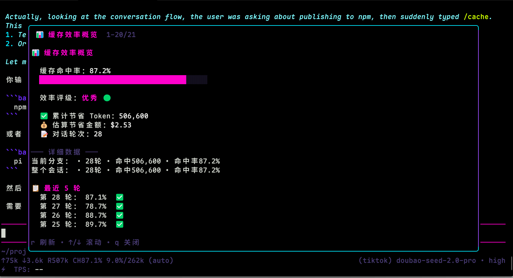

# pi-cache-extension 📊

[](https://www.npmjs.com/package/pi-cache-extension)
[](https://github.com/Q-Peppa/pi-cache-extension/blob/main/LICENSE)

一个简单友好的 pi 扩展，帮助你了解 AI 对话的缓存效率。



**核心功能：**
- 🎯 一眼看清缓存命中率（进度条 + 评级）
- 💰 累计节省了多少 Token，估算省了多少钱
- 📋 最近几轮对话的缓存命中情况

## 安装

### 推荐方式：npm 安装

在 pi 中直接安装：

```bash
pi install npm:pi-cache-extension
```

### GitHub 地址安装

```bash
pi install https://github.com/Q-Peppa/pi-cache-extension.git
```

### 本地开发：

```bash
git clone https://github.com/Q-Peppa/pi-cache-extension.git
cd pi-cache-extension
npm install
pi -e .
```

## 使用

在 pi 中输入：

```
/cache
```

即可看到：
- 📊 缓存命中率进度条
- 效率评级（优秀 🟢 / 良好 🟡 / 一般 🔴）
- 累计节省 Token 数和估算金额
- 最近几轮的命中情况

快捷键：
- `r` - 刷新数据
- `↑/↓` - 滚动
- `q` / `Esc` - 关闭

## 示例输出

```
📊 缓存效率概览

  缓存命中率：73.5%
  ████████████████████████░░░░░░░

  效率评级：优秀 🟢

  ✅ 累计节省 Token：124,580
  💰 估算节省金额：$0.62
  📝 对话轮次：42

  ─── 详细数据 ───
  当前分支：42轮 • 命中124580 • 命中率73.5%
  整个会话：42轮 • 命中124580 • 命中率73.5%

  📋 最近 5 轮
  第 42 轮： 85.2%  ✅
  第 41 轮： 78.1%  ✅
  第 40 轮： 32.5%  ⭕
  第 39 轮： 91.2%  ✅
  第 38 轮： 88.7%  ✅
```

## 为什么关心缓存？

- **省钱**：缓存命中的 Token 不用再花钱买
- **更快**：缓存的内容 AI 读取更快
- **了解**：知道你的对话模式对缓存友好程度
